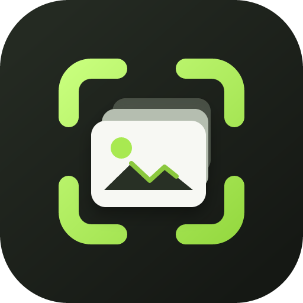

<p align="center">
  
</p>

# CaptureRecall

[](https://github.com/shadoprizm/capture-vault/actions/workflows/ci.yml)
[](https://github.com/shadoprizm/capture-vault/releases)
[](LICENSE)

> A calm, private home for screenshots you may need again.

Capture an area or a full display, then keep it in a searchable visual archive
instead of another forgotten folder. CaptureRecall keeps the library on your
device: no account, cloud sync, or analytics required.

The repository retains its original `capture-vault` name and stable application
identifier so existing libraries and operating-system permissions survive the
product rename.

## Download for macOS

CaptureRecall v0.3.0 adds an Apple Silicon preview for macOS 14 or newer. It
captures the main display with ScreenCaptureKit and selected regions with the
native macOS crosshair picker. The app hides itself before capture, runs OCR on
device, and keeps the library local by default.

[Download the latest macOS DMG](https://github.com/shadoprizm/capture-vault/releases/tag/v0.3.0).

The current preview is ad-hoc signed while the project awaits a Developer ID
Application certificate. macOS may require approval from **System Settings →
Privacy & Security** after download. A Gatekeeper-approved direct download also
requires Apple notarization; the release workflow is ready to perform it when
the required certificate and credentials are configured.

## Download for Linux

CaptureRecall v0.2.0 is an x86_64 Linux prerelease. Choose the package that fits
your desktop, or visit the [full v0.2.0 release](https://github.com/shadoprizm/capture-vault/releases/tag/v0.2.0)
for its RPM package and SHA-256 checksums.

### Ubuntu or Debian

[Download the `.deb` installer](https://github.com/shadoprizm/capture-vault/releases/download/v0.2.0/CaptureVault_0.2.0_amd64.deb),
then run this from the directory containing the downloaded file:

```bash
sudo apt install ./CaptureVault_0.2.0_amd64.deb
```

### Portable Linux build

[Download the AppImage](https://github.com/shadoprizm/capture-vault/releases/download/v0.2.0/CaptureVault_0.2.0_amd64.AppImage),
make it executable, and launch it:

```bash
chmod +x CaptureVault_0.2.0_amd64.AppImage
./CaptureVault_0.2.0_amd64.AppImage
```

## Compatibility and support status

| Platform                       | Status                      | Available package                 | Notes                                                                                                                              |
| ------------------------------ | --------------------------- | --------------------------------- | ---------------------------------------------------------------------------------------------------------------------------------- |
| Ubuntu/Debian, x86_64          | Linux prerelease            | `.deb`, AppImage                  | Recommended starting point; capture uses the system XDG Desktop Portal.                                                            |
| Other x86_64 Linux desktops    | Best effort                 | AppImage; RPM on the release page | Portal behavior varies by desktop environment and session.                                                                         |
| Windows                        | Experimental source support | None                              | Primary-monitor capture exists in source; it needs native-device validation and signing before an installer is published.          |
| macOS 14+, Apple Silicon       | Preview                     | DMG                               | Main-display and selected-area capture are implemented and tested on Apple hardware; the preview is not yet Developer ID notarized. |
| Snap Store / Ubuntu App Center | Not published               | None                              | Strict package metadata and payload validation are ready, but there is no Store listing yet.                                       |

## What ships

- Capture a selected area or full screen through the Linux system portal
- Keep PNG files and metadata locally
- Browse a responsive thumbnail library
- Search filenames, notes, tags, and capture types
- Add notes, tags, and favorites
- Copy a capture as both an image and PNG file for pasting or attaching
- Drag a capture directly into another app or folder as a native file copy
- Permanently delete a capture and its metadata

### New in v0.3.0

- CaptureRecall product branding while retaining the stable app identity and data directory
- Native Apple Silicon app and DMG packaging for macOS 14+
- Main-display capture through ScreenCaptureKit
- Selected-area capture through the native macOS crosshair picker, including Escape to cancel
- Hardened-runtime release configuration and repeatable Developer ID/notarization workflow
- Native macOS CI and regression coverage for Swift runtime linkage and canonical file paths

### New in v0.2.0

Alongside the original library features:

- Persistent, configurable global shortcuts for area and full-screen capture
- Local OCR, with detected text included in library search
- Optional semantic titles and descriptions generated from the whole image after explicit opt-in
- Search across titles, descriptions, detected text, filenames, notes, tags, and capture types
- Editable titles, descriptions, personal notes, tags, and favorites
- Re-running local OCR without overwriting personal notes or edited metadata

## Technology

- [Tauri 2](https://tauri.app/) desktop shell
- React and TypeScript interface
- Rust application core
- SQLite metadata store
- Local machine-learning OCR through [ocrs](https://github.com/robertknight/ocrs) and RTen
- Optional semantic image understanding through a loopback-only OpenAI-compatible vision endpoint
- XDG Desktop Portal integration through [ashpd](https://github.com/bilelmoussaoui/ashpd)

See [docs/ARCHITECTURE.md](docs/ARCHITECTURE.md) for the system design and [docs/PRODUCT.md](docs/PRODUCT.md) for the product scope.

## Build from source

Install the Tauri Linux prerequisites:

```bash
sudo apt update
sudo apt install libwebkit2gtk-4.1-dev build-essential curl file \
  libssl-dev libayatana-appindicator3-dev librsvg2-dev \
  libdbus-1-dev pkg-config
```

Install a current stable Rust toolchain and Node.js 22 or newer. Then:

```bash
npm install
npm run tauri dev
```

The browser-only interface preview is available with `npm run dev`, but screen capture and the persistent library require the Tauri desktop runtime.

## Optional semantic metadata

OCR runs locally by default. Whole-image semantic titles and descriptions are
**off by default** and require an explicit opt-in:

```bash
CAPTURE_VAULT_ENABLE_VISION=1 npm run tauri dev
```

When enabled, CaptureRecall sends the complete image to an OpenAI-compatible
service at `http://127.0.0.1:8083/v1/chat/completions` and uses
`Gemma 4 26B-A4B - Fast General` by default. Override these values with
`CAPTURE_VAULT_VISION_ENDPOINT` and `CAPTURE_VAULT_VISION_MODEL`. The endpoint
must remain on `127.0.0.1`, `localhost`, or `::1`; remote endpoints and HTTP
redirects are rejected. Setting an endpoint alone does not enable vision.

Only opt in when you trust the local service: CaptureRecall cannot prevent that
separate service from relaying data after it receives a capture. If it is off
or unavailable, OCR remains searchable and CaptureRecall leaves semantic
metadata untouched rather than manufacturing a title from detected text.

## Checks

```bash
npm run check
npm run build
cargo fmt --manifest-path src-tauri/Cargo.toml --check
cargo test --manifest-path src-tauri/Cargo.toml
```

## Privacy

CaptureRecall stores screenshots and its SQLite index in the operating system's application-data directory. By default, it does not upload screenshots or include analytics.

In v0.2.0, OCR runs from bundled local models. Optional
semantic analysis is disabled unless you explicitly set
`CAPTURE_VAULT_ENABLE_VISION=1`; then the whole image is sent to the configured
loopback service. CaptureRecall rejects non-loopback endpoints and redirects,
but cannot control what that separate local service does after receiving the
capture. The bundled OCR model currently targets Latin-alphabet text.
Screenshots can contain sensitive information; review a capture before sharing
it outside the application.

## Roadmap

1. Validate the capture flow across Ubuntu GNOME Wayland, Ubuntu X11, multiple displays, and mixed scaling.
2. Add tray controls.
3. Add export, reveal-in-folder, and configurable library locations.
4. Add a Developer ID Application identity and notarize the macOS direct download.
5. Validate and complete Windows capture with Windows Graphics Capture and signing.
6. Add non-destructive image annotation and richer opt-in visual descriptions.

## Contributing

See [CONTRIBUTING.md](CONTRIBUTING.md). By participating, you agree to keep CaptureRecall local-first and privacy-respecting.

## License

[MIT](LICENSE)
